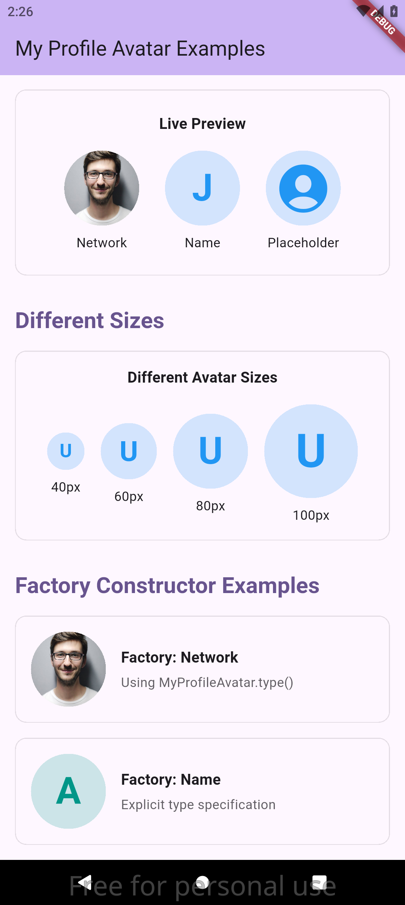
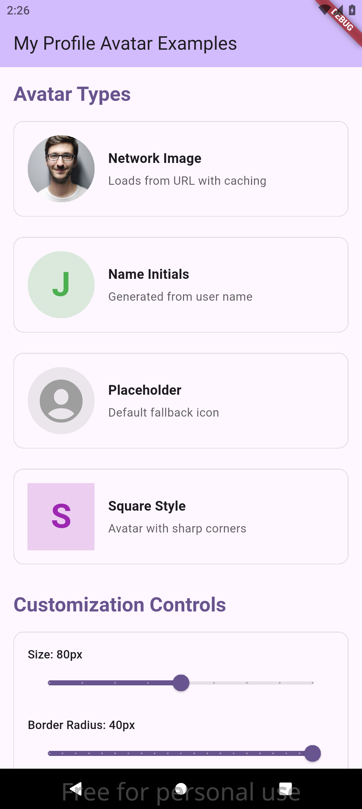

# My Profile Avatar

[](https://pub.dev/packages/my_profile_avatar)
[](https://opensource.org/licenses/MIT)
[](https://flutter.dev)

A customizable Flutter package for displaying profile avatars with support for multiple image sources including network images, local files, name initials, and placeholder icons.

## ✨ Features

- 🌐 **Network Images**: Display avatars from URLs with built-in caching support
- 📁 **Local Files**: Load avatar images from device storage
- 🔤 **Name Initials**: Generate text-based avatars from user names
- 🎭 **Placeholder Icons**: Show default avatar icons when no image is available
- 🎨 **Customizable Styling**: Control size, colors, and border radius
- ⏳ **Loading States**: Built-in loading indicators for network images
- 🛡️ **Error Handling**: Graceful fallbacks when images fail to load
- 📱 **Platform Support**: Works on iOS, Android, Web, and Desktop

## 📱 Screenshots

| Demo App Overview                                      | Interactive Controls                                       |
| ------------------------------------------------------ | ---------------------------------------------------------- |
|  |  |

## 🚀 Getting Started

### Installation

Add this to your package's `pubspec.yaml` file:

```yaml
dependencies:
  my_profile_avatar: ^1.0.0
```

Then run:

```bash
flutter pub get
```

### Import

```dart
import 'package:my_profile_avatar/my_profile_avatar.dart';
```

## 📖 Usage

### Basic Usage

```dart
MyProfileAvatar(
  style: MyProfileAvatarStyle(
    size: 60,
    color: Colors.blue,
    radius: 30,
  ),
  urlImage: 'https://example.com/avatar.jpg',
)
```

### Different Avatar Types

#### Network Image Avatar

```dart
MyProfileAvatar(
  style: MyProfileAvatarStyle(
    size: 80,
    color: Colors.blue,
    radius: 40,
  ),
  urlImage: 'https://images.pexels.com/photos/220453/pexels-photo-220453.jpeg',
)
```

#### Name Initials Avatar

```dart
MyProfileAvatar(
  style: MyProfileAvatarStyle(
    size: 60,
    color: Colors.green,
    radius: 30,
  ),
  name: 'John Doe',
)
```

#### Local File Avatar

```dart
MyProfileAvatar(
  style: MyProfileAvatarStyle(
    size: 100,
    color: Colors.purple,
    radius: 50,
  ),
  pathImage: '/path/to/local/image.jpg',
)
```

#### Placeholder Avatar

```dart
MyProfileAvatar(
  style: MyProfileAvatarStyle(
    size: 50,
    color: Colors.grey,
    radius: 25,
  ),
  // No image sources provided - shows placeholder
)
```

### Using the Type Factory Constructor

For more explicit control over avatar types:

```dart
// Network image avatar
MyProfileAvatar.type(
  type: MyProfileAvatarType.network,
  value: 'https://example.com/avatar.jpg',
  style: MyProfileAvatarStyle(
    size: 60,
    color: Colors.blue,
  ),
)

// Name initials avatar
MyProfileAvatar.type(
  type: MyProfileAvatarType.name,
  value: 'Alice Johnson',
  style: MyProfileAvatarStyle(
    size: 80,
    color: Colors.green,
  ),
)
```

### Styling Options

The `MyProfileAvatarStyle` class provides extensive customization options:

```dart
MyProfileAvatarStyle(
  size: 100,        // Width and height in logical pixels
  color: Colors.blue, // Primary color for text, icons, and loading indicators
  radius: 50,       // Border radius (50 = perfect circle for size 100)
)
```

#### Common Styling Patterns

```dart
// Perfect circle
MyProfileAvatarStyle(
  size: 80,
  color: Colors.blue,
  radius: 40, // Half of size
)

// Rounded square
MyProfileAvatarStyle(
  size: 60,
  color: Colors.green,
  radius: 12,
)

// Sharp square
MyProfileAvatarStyle(
  size: 50,
  color: Colors.red,
  radius: 0,
)
```

## 🔄 Priority System

The widget automatically determines which content to display based on this priority order:

1. **Local File** (`pathImage`) - Highest priority
2. **Network Image** (`urlImage`)
3. **Name Initials** (`name`)
4. **Placeholder Icon** - Lowest priority (fallback)

```dart
MyProfileAvatar(
  style: MyProfileAvatarStyle(color: Colors.blue),
  pathImage: '/local/image.jpg',    // This will be shown
  urlImage: 'https://example.com/avatar.jpg', // Ignored
  name: 'John Doe',                 // Ignored
)
```

## 🛠️ Advanced Usage

### Custom Error Handling

The widget includes built-in error handling, but you can also check the avatar type programmatically:

```dart
final avatar = MyProfileAvatar(
  style: MyProfileAvatarStyle(color: Colors.blue),
  urlImage: 'https://example.com/avatar.jpg',
);

// Check what type will be displayed
final avatarType = avatar.getType(); // MyProfileAvatarType.network
final avatarValue = avatar.getValue(); // 'https://example.com/avatar.jpg'
```

### Integration with User Profiles

```dart
class UserProfile extends StatelessWidget {
  final User user;

  const UserProfile({required this.user, super.key});

  @override
  Widget build(BuildContext context) {
    return Column(
      children: [
        MyProfileAvatar(
          style: MyProfileAvatarStyle(
            size: 120,
            color: Theme.of(context).primaryColor,
            radius: 60,
          ),
          urlImage: user.profileImageUrl,
          name: user.fullName,
        ),
        const SizedBox(height: 16),
        Text(user.fullName, style: Theme.of(context).textTheme.headlineSmall),
      ],
    );
  }
}
```

## 📋 API Reference

### MyProfileAvatar

| Parameter   | Type                   | Description                                        |
| ----------- | ---------------------- | -------------------------------------------------- |
| `style`     | `MyProfileAvatarStyle` | **Required.** Styling configuration for the avatar |
| `name`      | `String?`              | Optional name to display as initials               |
| `urlImage`  | `String?`              | Optional URL for network image                     |
| `pathImage` | `String?`              | Optional path to local image file                  |

### MyProfileAvatarStyle

| Parameter | Type     | Default      | Description                                   |
| --------- | -------- | ------------ | --------------------------------------------- |
| `color`   | `Color`  | **Required** | Primary color for text, icons, and indicators |
| `size`    | `double` | `50.0`       | Width and height in logical pixels            |
| `radius`  | `double` | `100.0`      | Border radius for rounded corners             |

### MyProfileAvatarType

| Value         | Description              |
| ------------- | ------------------------ |
| `placeholder` | Default placeholder icon |
| `network`     | Network image from URL   |
| `file`        | Local file image         |
| `name`        | Name initials as text    |

## 🤝 Contributing

Contributions are welcome! Please feel free to submit a Pull Request. For major changes, please open an issue first to discuss what you would like to change.

### Development Setup

1. Fork the repository
2. Clone your fork: `git clone https://github.com/mohamedmaher-dev/my_profile_avatar.git`
3. Create a feature branch: `git checkout -b feature/amazing-feature`
4. Make your changes and add tests
5. Run tests: `flutter test`
6. Commit your changes: `git commit -m 'Add amazing feature'`
7. Push to the branch: `git push origin feature/amazing-feature`
8. Open a Pull Request

## 🐛 Issues

If you encounter any issues or have feature requests, please file them in the [issues section](https://github.com/mohamedmaher-dev/my_profile_avatar/issues).

## 📄 License

This project is licensed under the MIT License - see the [LICENSE](LICENSE) file for details.

## 🙏 Acknowledgments

- Built with ❤️ using [Flutter](https://flutter.dev)
- Network image caching powered by [cached_network_image](https://pub.dev/packages/cached_network_image)
- Icons from [Cupertino Icons](https://pub.dev/packages/cupertino_icons)

---

**Made with ❤️ for the Flutter community**
